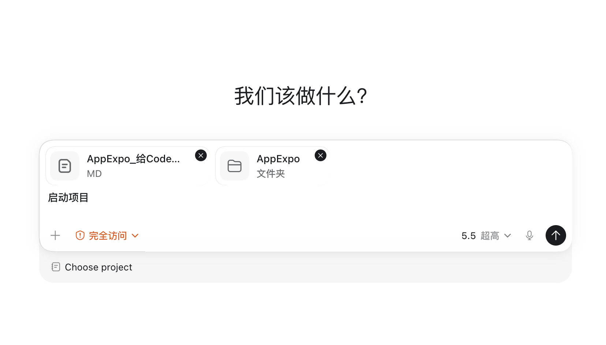

# AppExpo 使用教程

AppExpo 用于查看 Apple Store 展位、同步本地历史数据、分析历史排行，并每日采集 Games 页面的 Banner / Event 内容。

> 浏览器访问地址：`http://localhost:4173`

---

## 1. 快速启动提示

把下面两个内容一起交给 Codex：

| 内容 | 说明 |
| --- | --- |
| `AppExpo` 项目文件夹 | 项目代码和本地数据库 |
| `AppExpo_给Codex的启动交接.md` | 给 Codex 的启动说明 |



在 Codex 中输入：

```text
启动项目
```

启动完成后，在浏览器打开：

```text
http://localhost:4173
```

关闭项目时输入：

```text
关闭项目
```

---

## 2. 页面入口

| 页面 | 用途 |
| --- | --- |
| 实时分析 | 实时请求 Apple API，查看指定游戏当前是否命中 Today / Games 展位 |
| 本地同步 | 自动巡检各国家 / 地区展位，并写入本地历史数据库 |
| 历史记录 | 按日期、国家、游戏、页面范围查看原始入库记录 |
| 历史分析 | 基于本地历史数据做去重统计、国家排行和明细查看 |
| 每周一更 | 自动采集 Games 页面的 Banner 和 Event 内容 |

---

## 3. 实时分析

实时分析适合临时查看某个游戏当前在不同国家 / 地区的展位命中情况。


### 操作步骤

1. 在搜索框输入 `App ID`、游戏名称或关键词。
2. 在联想弹窗中选择国家 / 地区。
3. 选择 `Today` 或 `Games`。
4. 点击 **开始分析**。


### 选择方式

| 按钮 | 作用 |
| --- | --- |
| 全部 | 选择该游戏关联的全部国家 / 地区 |
| 多选 | 手动选择多个国家 / 地区 |
| 单选 | 只选择一个国家 / 地区 |
| 清空 | 清除当前选择 |
| 完成 | 确认选择并关闭弹窗 |


---

## 4. 本地同步

本地同步用于把 Today / Games 展位数据写入本地历史数据库，历史记录和历史分析都依赖这里的数据。


### 功能说明

| 功能 | 说明 |
| --- | --- |
| 同步频率 | 设置自动同步间隔，例如每 2 小时 |
| 启动定时 | 开启自动同步任务 |
| 停止定时 | 关闭自动同步任务，并取消下一次运行 |
| 立即执行 | 不等定时，马上同步一次 |
| 当前状态 | 显示定时任务是否启动 |
| 下次执行 | 显示下一次自动同步时间 |
| 最近完成 | 显示最近一次同步完成时间 |

### 注意事项

- 不要删除本地数据库。
- 电脑关机、休眠、合盖断网时，自动任务不会执行。
- 如果错过定时任务，重新打开项目后可以点击 **立即执行** 补一次。

---

## 5. 历史记录

历史记录用于查看已经写入本地数据库的原始同步数据。


### 查询条件

| 条件 | 说明 |
| --- | --- |
| 同步日期 | 选择要查看的入库日期 |
| 游戏名称 | 按游戏筛选 |
| App ID | 按 App ID 精确筛选，留空表示全部 |
| 国家筛选 | 查看全部国家或指定国家 |
| 页面范围 | 全部 / Today / Games |

点击 **查询历史** 后，会展示对应日期的历史入库结果。

### 页面结构

- 左侧：国家分布，展示不同国家 / 地区的命中数量。
- 右侧：具体展位内容，包括标题、图片、国家、页面类型等。
- 顶部：同步天数、命中展位数量、涉及国家数量。

---

## 6. 历史分析

历史分析用于查看一段时间内的国家排行、展位命中和去重后的统计结果。


### 搜索方法

历史分析的搜索方式和实时分析一样：

1. 输入 `App ID`、游戏名称或关键词。
2. 在联想弹窗中选择国家 / 地区。
3. 支持 **全部 / 多选 / 单选 / 清空 / 完成**。
4. 选择日期范围后点击 **开始分析**。

历史分析不单独从数据库里搜索游戏列表，而是沿用实时分析的游戏聚合搜索模式。

### 日期范围

支持：

- 近 1 天
- 近 3 天
- 近 7 天
- 自定义

如果选择近 7 天，但数据库中只有近 3 天记录，系统只分析已有数据，不会因为缺少日期而判定无数据。

### 国家排行

国家排行使用横向柱状图展示命中情况，可切换：

| 维度 | 含义 |
| --- | --- |
| Total | 总命中 |
| Today | Today 展位命中 |
| Icon | Games · Icon 命中 |
| Banner | Games · Banner 命中 |

每一行代表一个国家 / 地区，右侧显示命中数量和占比。柱状图越长，代表命中越多。

### 点击国家查看详细

点击国家排行中的任意国家 / 地区，会弹出该国家在当前日期范围内的详细展位信息。


弹窗按分类展示：

- Today
- Games · Icon
- Games · Banner

每条明细包含展位图片、标题、副标题、游戏名称、App ID、命中天数和原始记录数。

### 去重复逻辑

历史分析会合并重复命中，避免同一内容连续多天出现导致排行虚高。

去重标准：

> 同一个国家 / 地区内，**同展位 + 同名称 + 同标题** 视为同一条内容。

例如同一个活动连续 5 天出现在同一展位：

| 字段 | 含义 |
| --- | --- |
| 去重命中 | 只计算为 1 条有效命中 |
| 原始记录 | 数据库中实际保存的原始记录数量 |
| 命中几天 | 该内容在所选日期范围内出现过几天 |

---

## 7. 每周一更

每周一更用于采集 Games 页面中的两个区域：

- Games · Banner
- Games · Event


### 页面结构

| 区域 | 说明 |
| --- | --- |
| 国家 / 地区 | 选择要查看的地区 |
| 当前周次 | 查看本周或历史周次 |
| 今日日期 | 展示当天日期 |
| 周一到周日 | 点击某一天，切换下方内容 |
| Games · Banner | Games 页面轮播 Banner |
| Games · Event | Games 页面游戏活动 |

### 自动采集逻辑

- 每天早上 `06:00` 开始检查当天数据。
- 如果当天数据没有抓全，每小时继续检测和补抓。
- 如果当天全部国家抓取完成，当天不再重复抓。
- 进入每周一更页面时，如果当天没有抓全，会自动触发抓取。

### 使用方式

1. 进入 **每周一更** 页面。
2. 选择国家 / 地区。
3. 选择当前周次或历史周次。
4. 点击周一到周日任意一天。
5. 查看该日期的 Games · Banner 和 Games · Event。

---

## 8. 日常使用建议

| 目标 | 使用页面 | 操作 |
| --- | --- | --- |
| 查看当前展位 | 实时分析 | 搜索游戏 → 选国家 → 选 Today / Games → 开始分析 |
| 保存历史数据 | 本地同步 | 设置频率 → 启动定时，或点击立即执行 |
| 查看某天原始记录 | 历史记录 | 选择日期、国家、游戏或 App ID → 查询历史 |
| 查看一段时间排行 | 历史分析 | 搜索游戏 → 选日期范围 → 开始分析 → 点击国家看详情 |
| 查看 Banner / Event | 每周一更 | 选择国家和周次 → 点击日期 → 横向查看内容 |

---

## 9. 数据说明

AppExpo 使用本地 SQLite 数据库保存历史数据。

请不要删除：

```text
data/appexpo_local.db
```

删除数据库后，历史记录、历史分析、每周一更的历史数据都会丢失。
