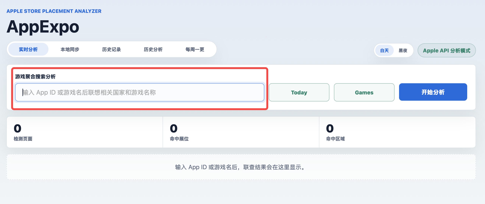
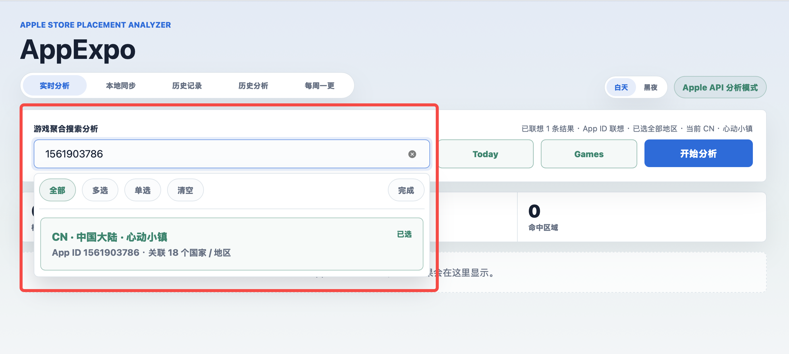
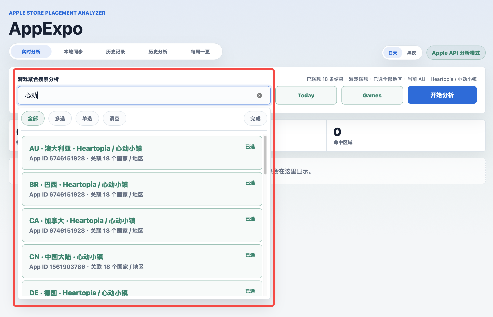
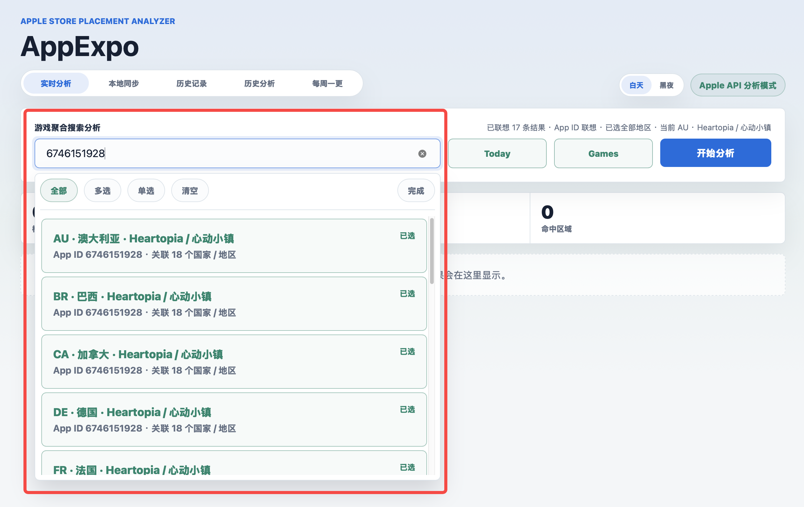
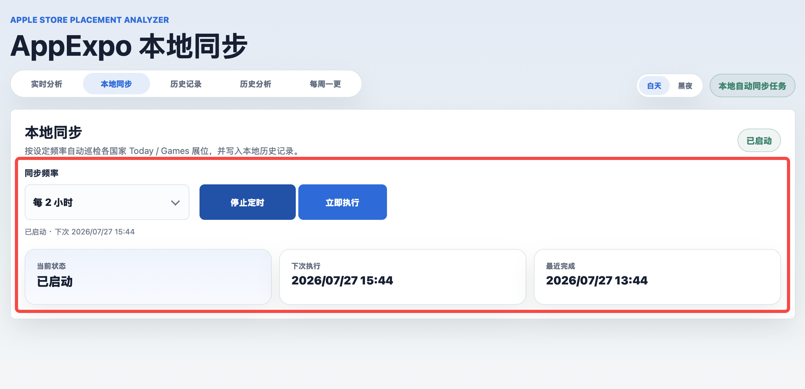
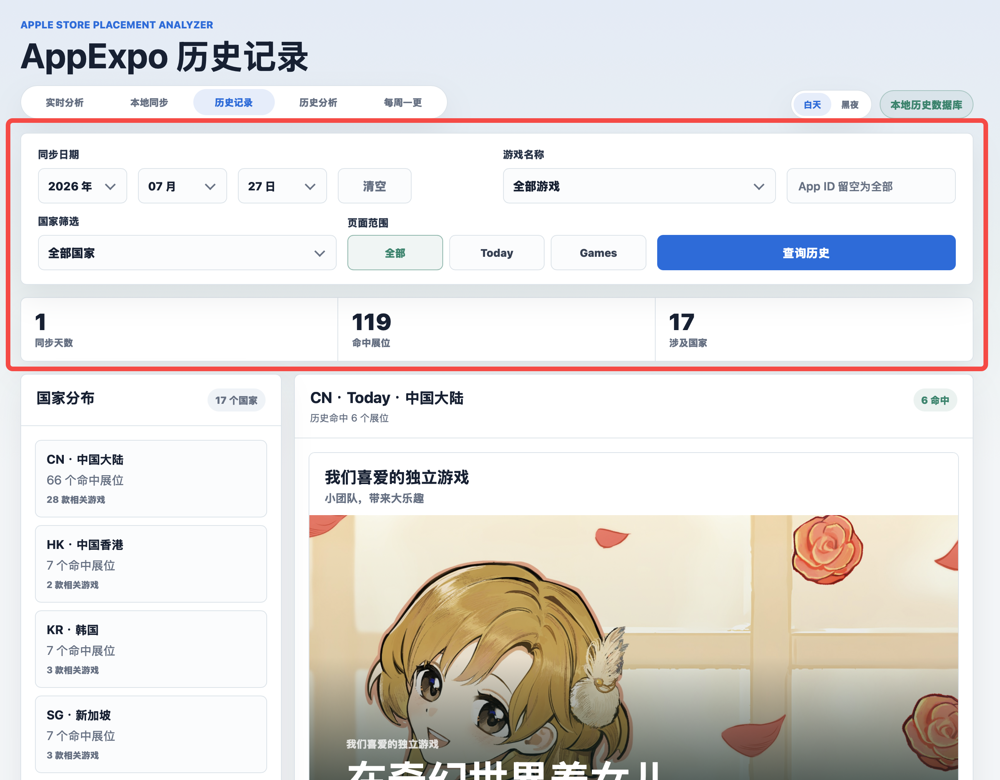
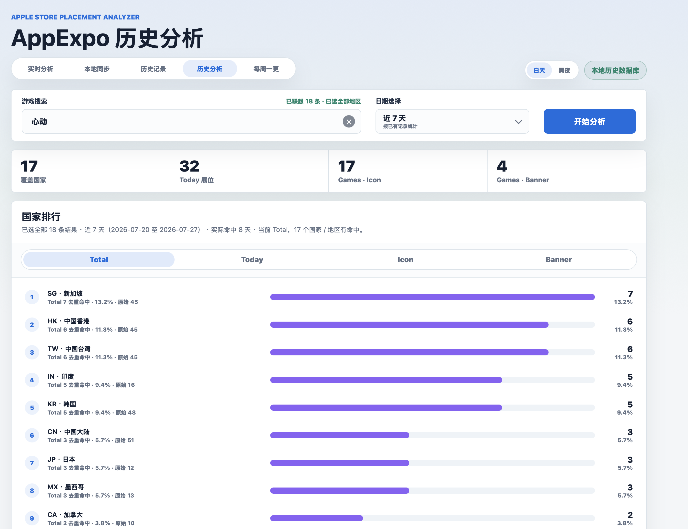
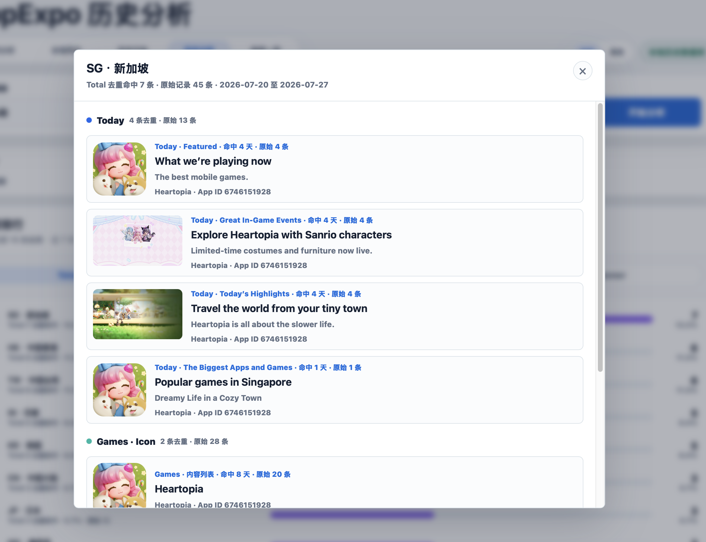

# AppExpo 使用教程

AppExpo 是一个用于查看 Apple Store 展位、同步本地历史记录、做历史统计分析，以及每日采集 Games 页面 Banner / Event 的本地工具。

> 推荐使用浏览器打开：`http://localhost:4173`

## 1. 快速启动提示

新电脑现在不需要手动拷贝整个项目文件夹。直接把 GitHub 仓库地址发给 Codex，让 Codex 拉取项目并启动即可。

首次安装时，直接把下面这一整段发给 Codex：

```text
安装项目AppExpo

仓库地址：git@github.com:shengyuxiaowb-hash/AppExpo.git
请拉取到：~/Desktop/AppExpo

如果新电脑没有配置 SSH，就改用：
https://github.com/shengyuxiaowb-hash/AppExpo.git

首次拉取时保留仓库里的 data/appexpo_local.db，不需要单独更新数据库。

拉完后先阅读项目根目录的 AppExpo_给Codex的启动交接.md，然后检查环境并启动项目。

启动成功后告诉我浏览器访问地址。
```

项目已经在电脑上时，日常启动只需要输入：

```text
启动项目
```

项目启动完成后，在浏览器打开：

```text
http://localhost:4173
```

关闭项目时输入：

```text
关闭项目
```

### 常用 Codex 指令

| 指令 | 用途 | 是否覆盖数据库 |
| --- | --- | --- |
| `安装项目` | 新电脑首次从 GitHub 拉取项目，并启动 | 会拉取 GitHub 自带数据库 |
| `启动项目` | 启动本地 AppExpo 服务 | 不影响数据库 |
| `关闭项目` | 关闭 `4173` 端口上的 AppExpo 服务 | 不影响数据库 |
| `更新项目` | 只更新代码、页面、文档、skill | 不覆盖本机数据库 |
| `更新数据库` | 只用 GitHub 数据库替换本机数据库 | 会覆盖，覆盖前会备份 |

推荐日常更新使用：

```text
更新项目
启动项目
```

只有明确需要同步主电脑数据库时，才使用：

```text
更新数据库
启动项目
```

---

## 2. 页面入口

顶部导航包含 5 个主要页面：

- **实时分析**：实时请求 Apple API，查看指定游戏在各国家 / 地区的 Today、Games 展位情况。
- **本地同步**：按频率自动抓取各国家 Today / Games 展位，并写入本地历史数据库。
- **历史记录**：按日期、国家、游戏、页面范围查看已入库的原始历史记录。
- **历史分析**：基于本地历史数据库做去重统计、国家排行和明细查看。
- **每周一更**：自动采集各国家 Games 页面中的 Banner 和 Event 内容。

---

## 3. 实时分析

实时分析用于直接请求 Apple API，适合查看某个游戏当前在不同国家 / 地区是否命中 Today 或 Games 展位。



### 搜索方式

在搜索框中可以输入：

- App ID
- 游戏名称
- 游戏名称关键词

输入后会出现联想结果，下拉结果中会展示国家 / 地区、游戏名称、App ID 和关联国家数量。







### 选择方式

搜索弹窗支持：

- **全部**：选择该游戏关联的全部国家 / 地区。
- **多选**：手动选择多个国家 / 地区。
- **单选**：只选择一个国家 / 地区。
- **清空**：清除当前选择。
- **完成**：确认选择并关闭弹窗。

选择完成后，可以点击：

- **Today**：分析 Today 页面展位。
- **Games**：分析 Games 页面展位。
- **开始分析**：正式发起实时分析。

---

## 4. 本地同步

本地同步用于把各国家 / 地区的 Today / Games 展位数据保存到本地历史数据库，后续历史记录和历史分析都依赖这些入库数据。



### 功能说明

- **同步频率**：设置自动同步间隔，例如每 2 小时。
- **启动定时**：开启自动同步任务。
- **停止定时**：关闭自动同步任务，并取消下一次运行。
- **立即执行**：不等定时，马上抓取一次并写入本地历史记录。
- **当前状态**：显示定时任务是否启动。
- **下次执行**：显示下一次自动同步时间。
- **最近完成**：显示最近一次同步完成时间。

### 注意事项

- 本地数据库文件不要删除。
- 电脑关机、休眠、合盖断网时，自动任务不会正常执行。
- 如果电脑睡眠期间错过定时任务，重新打开项目后可以手动点“立即执行”补一次。

---

## 5. 历史记录

历史记录页面用于查看已经写入本地数据库的原始同步数据。



### 查询条件

可以按以下条件筛选：

- 同步日期
- 游戏名称
- App ID
- 国家筛选
- 页面范围：全部 / Today / Games

点击 **查询历史** 后，页面会展示对应日期的历史入库结果。

### 页面结构

- 左侧是国家分布，展示不同国家 / 地区的命中数量。
- 右侧是具体展位内容，包括标题、图片、国家、页面类型等信息。
- 顶部统计会显示同步天数、命中展位数量、涉及国家数量。

---

## 6. 历史分析

历史分析页面基于本地历史数据库做统计分析，适合查看一段时间内不同国家 / 地区的展位命中情况。



### 搜索方法

历史分析中的搜索方式和实时分析一样。

也就是说，可以直接输入：

- App ID
- 游戏名称
- 游戏关键词

搜索后会出现同样的联想选择弹窗，也支持：

- 全部
- 多选
- 单选
- 清空
- 完成

历史分析不需要单独从数据库里搜索游戏列表，而是沿用实时分析的游戏聚合搜索模式。选择游戏和国家后，再选择日期范围并点击 **开始分析**。

### 日期范围

日期选择是按已有本地记录统计，例如：

- 近 1 天
- 近 3 天
- 近 7 天
- 自定义

如果选择近 7 天，但数据库中只有近 3 天数据，系统只分析已有的 3 天记录，不会因为缺少日期而判定无数据。

### 国家排行

国家排行用横向柱状图展示命中情况，支持切换：

- **Total**：总命中
- **Today**：Today 展位命中
- **Icon**：Games · Icon 命中
- **Banner**：Games · Banner 命中

每个国家 / 地区一行，右侧显示命中数量和占比。柱状图越长，说明该国家 / 地区在当前维度下命中越多。

### 点击国家查看详细

国家排行中的每一行都可以点击。

点击某个国家 / 地区后，会弹出该国家在当前日期范围内的详细展位信息。



弹窗内会按分类展示：

- Today
- Games · Icon
- Games · Banner

每个分类下会展示对应的展位图片、标题、副标题、游戏名称、App ID、命中天数和原始记录数。

### 去重复逻辑

历史分析会对重复命中进行合并，避免同一个内容在多天重复出现时把排行数量抬高。

去重标准是：

> 同一个国家 / 地区内，**同展位 + 同名称 + 同标题** 视为同一条内容。

举例说明：

- 同一个游戏活动连续 5 天出现在同一个展位。
- 原始数据库里可能有 5 条记录。
- 历史分析中只计算为 1 条去重命中。
- 同时会保留“命中几天”和“原始记录数”用于参考。

弹窗中的含义：

- **去重命中**：去重后的有效命中数量。
- **原始记录**：数据库里实际保存的原始记录数量。
- **命中几天**：该内容在所选日期范围内出现过几天。

这个逻辑主要用于让国家排行更直观，避免同一个展位内容重复多天导致统计失真。

---

## 7. 每周一更

每周一更页面用于采集 Games 页面中的两个区域：

- **Games · Banner**
- **Games · Event**


### 页面结构

顶部区域包含：

- 国家 / 地区
- 当前周次
- 今日日期

中间是周一到周日的日期卡片。点击某一天后，下方会切换展示该日期的入库内容。

下方分为两个模块：

- **Games · Banner**：Games 页面轮播 Banner。
- **Games · Event**：Games 页面游戏活动内容。

### 自动采集逻辑

每周一更是自动采集，不需要手动点击抓取。

当前逻辑：

- 每天早上 06:00 开始检查当天数据。
- 如果当天数据没有抓全，会每小时继续检测和补抓。
- 如果当天全部国家都抓取完成，当天就不再重复抓。
- 进入每周一更页面时，如果发现当天没有抓全，会自动触发抓取。

### 使用方式

1. 进入 **每周一更** 页面。
2. 选择国家 / 地区。
3. 选择当前周次或历史周次。
4. 点击周一到周日任意一天。
5. 查看该日期的 Games · Banner 和 Games · Event。

---

## 8. 日常使用建议

### 查看当前展位

使用 **实时分析**：

1. 输入 App ID 或游戏名称。
2. 在弹窗中选择国家 / 地区。
3. 选择 Today 或 Games。
4. 点击开始分析。

### 保存历史数据

使用 **本地同步**：

1. 设置同步频率。
2. 点击启动定时。
3. 或点击立即执行手动同步一次。

### 查看某天原始记录

使用 **历史记录**：

1. 选择日期。
2. 选择国家、游戏或 App ID。
3. 点击查询历史。

### 查看一段时间内的排行

使用 **历史分析**：

1. 按实时分析同样的方式搜索游戏。
2. 选择国家 / 地区。
3. 选择近 1 天、近 3 天、近 7 天或自定义日期。
4. 点击开始分析。
5. 点击国家排行中的国家查看详情。

### 查看 Games Banner / Event 每日变化

使用 **每周一更**：

1. 进入页面后等待自动采集。
2. 选择国家和周次。
3. 点击具体日期。
4. 横向查看 Games · Banner 和 Games · Event。

---

## 9. 数据说明

AppExpo 主要依赖本地 SQLite 数据库保存历史数据。

请不要删除数据库文件：

```text
data/appexpo_local.db
```

如果数据库被删除，历史记录、历史分析、每周一更的历史数据都会丢失。
